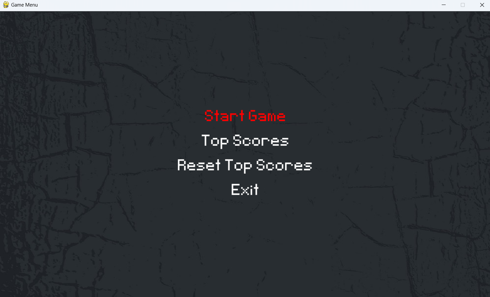

# Python Jump-Game

    

## Overview
Welcome to [Jump-game], an exhilarating adventure that takes you on a journey through the prehistoric landscape. Inspired by the classic Google Dinosaur Game, [Jump-game] puts you in control of a fearless dinosaur as you navigate through a world filled with obstacles and challenges.

### Features:
#### Endless Runner Gameplay: 
- Experience the thrill of an endless runner game as you dash through the desert landscape, jumping over cacti and dodging obstacles to achieve the highest score.

#### Simple Controls: 
- With easy-to-learn controls, players of all ages can quickly pick up and play. Just a tap or a click is all it takes to jump over obstacles and keep your dinosaur running.

#### Dynamic Environment: 
- Encounter dynamically generated terrain and obstacles that keep each run fresh and exciting. No two playthroughs are the same!

#### Power-Ups and Bonuses: 
- Collect power-ups and bonuses along the way to enhance your gameplay experience. From speed boosts to protective shields, these items provide a temporary advantage to help you overcome challenges.

## Demo
### Menu (Screenshot)

### Game (Screenshot)

## Installation
-git clone

-intall pygame (if you have pip you can use pip intall pygame)

## Usage
You can play and enjoy the game, there also you can set new records or reset it.

## Acknowledgments
graphics from [freepik.com](https://www.freepik.com/) and [stock.adobe.com](https://stock.adobe.com/kz/)

## Author
Yeraly Kuatuly
Email: YeralyKuatuly@gmail.com
